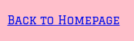

# Rock, Paper, Scissors
Rock, paper scissors is a fun online game. It can be played alone or with a friend. Get ready to throw down some moves and see who comes out on top!

You can view the live site here - [Rock-Paper-Scissors](https://tee-24.github.io/Rock-Paper-Scissors/index.html)

## User Experience (UX)

### Target Audience
* Users that would like to play a game of rock, paper, scissors
* Users who would like to play an online game of rock, paper, scissors, versus a computer
* Users who would like to play a 2-player game of rock, paper, scissors online

### User Stories
* A user should be able to determine the site's purpose immediately
* A user should be able to easily and intuitively navigate the site
* A user should find it easy to determine the winner of the game

### Site Aims
* To offer a fun game to play
* To allow a single player to play against the computer
* To allow two players to play against each other

## Features

The website consists of 4 pages; the landing page, the game page for one player, and the game page for two players. The fourth page is a 404 error page which will open if the user clicks on a broken link.

* All Pages on the website have:

  * Favicon - This will provide an image in the the tab's header to allow the user to easily identify the website if they have multiple tabs open. The video game emoji was chosen as it matched the theme of the website.

  

  * A responsive header containing the name of the game.

  

  * Buttons - When the mouse hovers over the buttons, the background color of the button changes to aqua.

  

  * A responsive footer.

  

* Landing Page
  * Start Game button - When clicked, this button will change the content of the page and show 2 new buttons which will allow the user to select whether there are one or two players.

 
 
  * Instructions button - When clicked, a modal, containing the instructions for the game, will pop up.

  

* Game Page (1 Player)
  * Score section - A responsive score tracker under the header which tallies the number of wins of the user and the computer.

  

  * Game area - Here, the user will choose either rock, paper or scissors. The buttons will become disabled once the user has made a choice.

  

  * Display area - This will display the user's choice, the computer's choice, and the result of the game.

  

  * Play again button - This will clear the display area and reset the game to be played again.

  

  * Back to homepage button - This button will return the user back to the landing page.

  

* Game Page (2 Player)
  * Score section - A responsive score tracker under the header which tallies the number of wins of Player 1 and Player 2.

  

  * Game area - This is split into 2 sections. In the first section, Player 1 will choose either rock, paper or scissors. In the second section, Player 2 will choose either rock, paper or scissors. The buttons will become disabled once both players have made a choice.

  

  * Display area - This will display Player 1 choice, Player 2 choice, and the result of the game.

  

  * Play again button - This will clear the display area and reset the game to be played again.

  

  * Back to homepage button - This button will return the user back to the landing page.

  

## Technologies Used

* HTML5 - Delivers the structure and content for the game
* CSS3 - Provides the styling for the game
* Gitpod - Used to develop the website
* JavaScript - Provides functionality for the game
* Balsamiq - Used to create wireframes for the website
* Git - For version control
* Gitpod - Used to develop the website
* Gitbash - Terminal used to push changes to the GitHub repository
* GitHub - Used to host and deploy the website
* Google Dev Tools - To troubleshoot and test features, solve issues with responsiveness and styling
* [Wave Accessibility](https://wave.webaim.org/) tool was used throughout development and for final testing of the deployed website to check for any aid accessibility testing
* [Google Fonts](https://fonts.google.com/) - Used to import the font used on the website
* [Favicon Generator](https://favicon.io/) - Used to create the favicon for the website
* [Am I Responsive](http://ami.responsivedesign.is/) - To show the website image on a range of devices

## Deployment & Local Development

### Deployment
The website was deployed to GitHub pages via the following steps:
1. Log in (or sign up) to Github
2. Go to the repository for this project
3. Click settings 
4. Under code and automation, click pages
5. Select main branch
6. Click save

### Local Development

#### How to Fork
To fork the repository:
1. Log in (or sign up) to Github
2. Go to the repository for this project
3. Click the Fork button in the top right corner

#### How to Clone
To clone the repository:
1. Log in (or sign up) to Github
2. Go to the repository for this project
3. Click on the code button, select whether you would like to clone with HTTPS, SSH or GitHub CLI
4. Copy the link shown
5. Open the terminal in your code editor and change the current working directory to the location you want to use for the cloned directory
6. Type 'git clone' into the terminal 
7.  Paste the link you copied in step 3
8. Press enter

### Manual Testing
To fully test my website I performed the following testing using a number of browsers (Google Chrome and Safari) and devices (HP laptop, iPad Pro 12.9 inch, iPhone 11 pro max).

| Test                         | Action                                                                                                                                                 | Expected Result                                                                                                                                                                                                                                                          | Pass/Fail |
| ---------------------------- | ------------------------------------------------------------------------------------------------------------------------------------------------------ | ------------------------------------------------------------------------------------------------------------------------------------------------------------------------------------------------------------------------------------------------------------------------ | --------- |
| Test start game button       | Click the start game button                                                                                                                            | Displays 1 player button and 2 player button                                                                                                                                                                                                                             | Pass      |
| Test hover effect on buttons | Place mouse over each button                                                                                                                           | Background color should turn aqua                                                                                                                                                                                                                                        | Pass      |
| Test instructions button     | Click the instructions button                                                                                                                          | Opens instruction modal                                                                                                                                                                                                                                                  | Pass      |
| Test closing modal           | Click X at the top                                                                                                                                     | Modal closes                                                                                                                                                                                                                                                             | Pass      |
| Test 1 player game           | Click on a choice                                                                                                                                      | If player wins, player's score should increase by 1 and buttons should be disabled  If computer wins, computer's score should increase by 1 and buttons should be disabled  If it's a tie, both scores should remain the same and buttons should be disabled | Pass      |
| Test 2 player game           | Choose rock for Player 1 and Player 2  Choose paper for Player 1 and rock for Player 2  Choose scissors for Player 1 and rock for Player 2 | Tie, scores should remain the same and buttons should be disabled  Player 1 score should increase by 1 and buttons should be disabled  Player 2 score should increase by 1 and buttons should be disabled                                                    | Pass      |
| Test play again button       | Click play again button                                                                                                                                | Buttons should be re-enabled Display area should be clear                                                                                                                                                                                                             | Pass      |
| Test back to homepage button | Click back to homepage button                                                                                                                          | Landing page should open                                                                                                                                                                                                                                                 | Pass      |
### Known Bugs

1. After clicking the play again button, the result of the game is no longer printed to the display. However, the scores are still updating accordingly

## Credits
* Fonts were sourced from [Google Fonts](https://fonts.google.com/)
* Favicon was sourced from [Favicon Generator](favicon.io)
* Button disabled property was learned from [W3 Schools](https://www.w3schools.com/jsref/prop_pushbutton_disabled.asp)
* Modal box was learned from [W3 Schools](https://www.w3schools.com/howto/howto_css_modals.asp)
* [Table to Markdown](https://tabletomarkdown.com/) was used to cnvert Google sheets to Markdown language

### Acknowledgements
This site was designed and developed in conjunction with the Full Stack Software Developer Diploma course (ecommerce) at the Code Institute. I would like to thank my mentor, Daisy, the Slack community, and Code Institute for all their support.